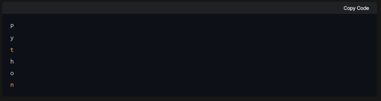

# Midterm - Using Loops Activity #2

1. Define a word for the code to run over, and iterate characters in each string

Sample output:

2. we'll use a `while` loop to calculate the average grade of a student based on their grades in multiple subjects.

* We initialize variables to keep track of the total grades and the number of subjects.
* The `while` loop runs as long as there are still subjects left (i.e., `num_subjects > 0`).
* Inside the loop, we get the grade for each subject from the user using `input()`.
* We add each grade to the total grades and decrement the number of subjects left.
* Once all grades have been entered, we calculate the average grade by dividing the total grades by the number of subjects.
* Finally, we print out the calculated average grade

3. Running on a particular treadmill you burn 4.2 calories per minute. Write a program that uses a loop to display the number of calories burned after 10, 15, 20, 25, and 30 minutes.
