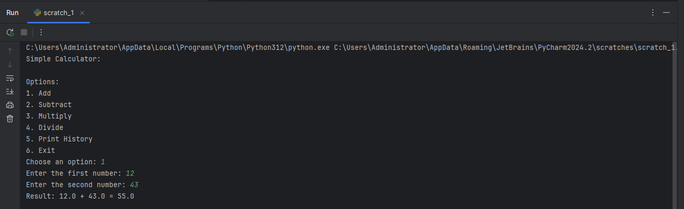

# Finals - Simple Calculator using Functions

Create a simple arithmetic calculator using functions to define Addition, Subtraction, Multiplication and Division - Use our standard format for your submission (e.g. Dela Cruz, Rinel - ICT-102 - Simple Calculator.py ---- Also same for the output file)

This simple calculator should provide the basic arithmetic operations:

* **Add**: Adds two numbers
* **Subtract** : Subtracts one number from another.
* **Multiply** : Multiplies two numbers.
* **Divide** : Divides one number by another (raises an error if divided by zero).

<ins>For Additional 5 Points, it should keep a record of the calculations performed in its history. The user can print this history at any time.<ins>

## Sample Output

Guide: Note that the calculator uses loop to continuously prompt the user for input until they choose to exit.
