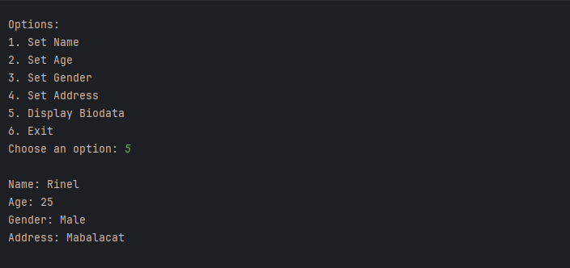

# Finals - Simple Biodata Activity

`User` This program creates a class with methods to set each biodata field `display_biodata()` (name, age, gender, and address). The method prints out the user's biodata in a formatted string.

`main()` The function uses a while loop to allow users to interact with the program. Users can choose from various options to set their biodata fields or display their current biodata. When they're done, they can exit the program by choosing option 6.

Note that this program includes some basic validation for each biodata field (e.g., checking if the age is within a valid range).

Sample Output:

