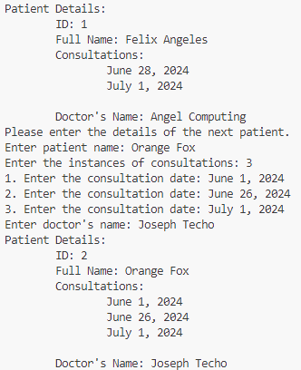

# Week 1 Assignment 1 (Class)

## Quiz Instructions

Create each Java application according to the problem requirements in Questions 1 and 2. Upload the Java application (.java) in Questions 1 and 2 in the provided field. Take a screenshot of your sample application output (.png, .jpg, or others). Then, upload it in the provided field in Question 3. Click Submit Quiz to finalize your answers. Good luck!

### Question 1

Create a class based on the UML attached. 

[patient.pdf](./docs/patient.pdf)

### Question 2

Create a class with the main() method to test the Patient class. Instantiate two Patient objects and use the methods to get and set the data fields, and to print the patient details.

### Question 3

Upload a sample output screenshot of the class with the main() method having Patient objects in the provided field below.

